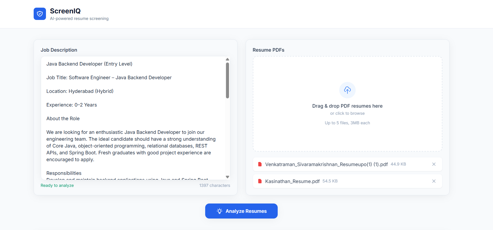
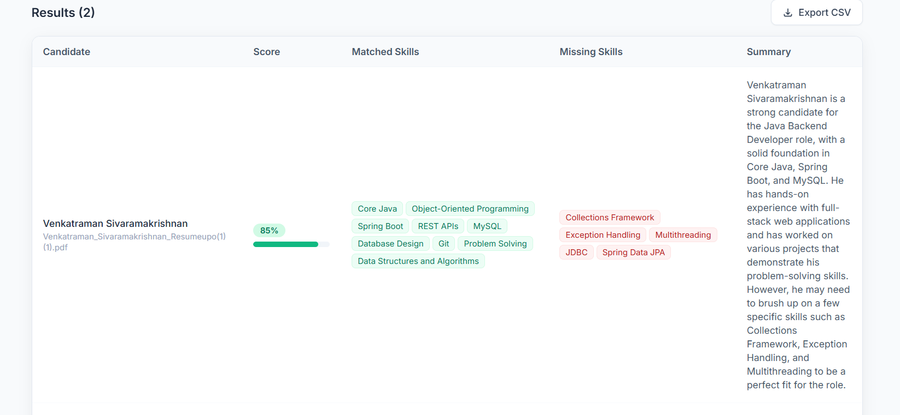
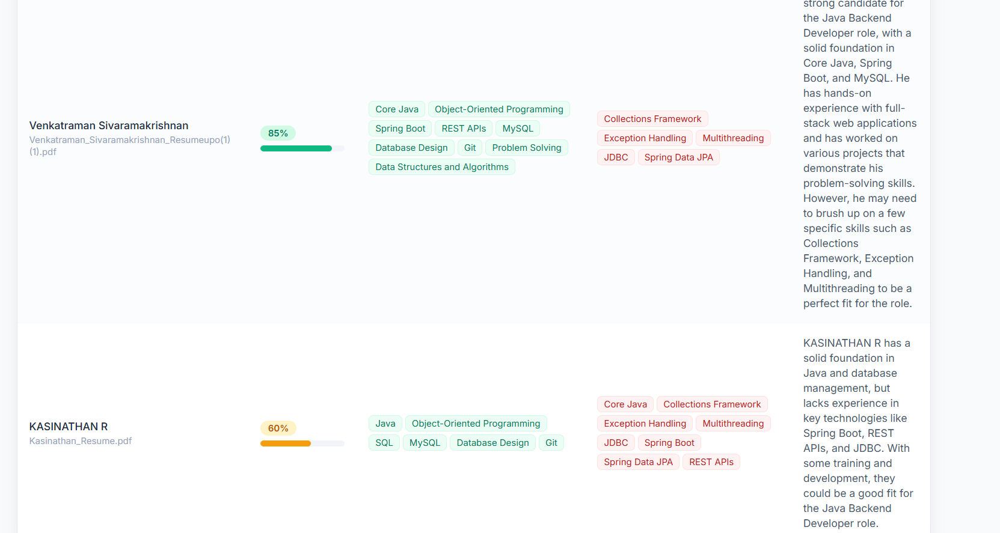
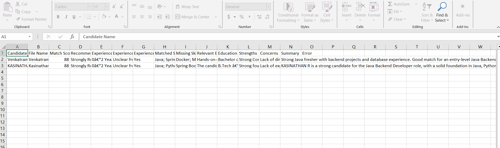

# ScreenIQ — AI Resume Screening Assistant


[](https://github.com/sivrkv/screeniq/actions)

ScreenIQ is an AI-powered resume screening assistant that helps recruiters evaluate candidates against job requirements in minutes instead of hours.

Upload resumes, provide a job description, and get AI-generated candidate rankings with match scores, relevant skills, missing requirements, and summaries — with an exportable shortlist.

**Live Demo:** https://screeniq-n8bq5m028-sivas-projects-ad73775a.vercel.app  
**Repository:** https://github.com/sivrkv/screeniq

---

## Screenshots

### Resume Upload



### AI Screening Results
 


### Export Candidate Result


---

## Overview

Recruiters and hiring managers spend significant time manually reviewing resumes for open positions. The initial screening process involves:

- Reading resumes individually
- Comparing candidate skills against job requirements
- Identifying suitable candidates
- Creating a shortlist

This repetitive process does not scale well as applications increase.

ScreenIQ automates the first screening stage by extracting candidate information, comparing resumes against job descriptions, and generating ranked results — while keeping the final hiring decision with the recruiter.

---

# Features

## AI-Powered Resume Analysis

- Paste any job description
- Upload multiple PDF resumes
- Automatically extract resume content
- Analyze candidate-job compatibility using AI
- Generate match scores from 0–100

## Candidate Ranking

- Ranked candidates by relevance score
- Matched skills identification
- Missing must-have skills detection
- AI-generated candidate summaries

## Export

- Export results as CSV
- Client-side CSV generation
- No additional server request required

## Reliability

- Supports up to 5 resumes per request
- Maximum 3MB PDF size per file
- Individual candidate error handling
- One failed resume does not stop the entire batch
- Responsive UI for desktop and mobile

---

# Tech Stack

| Layer | Technology |
|---|---|
| Framework | Next.js 14 (App Router) |
| Language | TypeScript (Strict Mode) |
| Styling | Tailwind CSS |
| Validation | Zod |
| PDF Processing | pdf-parse |
| AI Model | Groq API — Llama 3.3 70B |
| AI Integration | OpenAI-compatible SDK |
| Deployment | Vercel |
| CI/CD | GitHub Actions |

The application intentionally avoids unnecessary infrastructure:

- No database
- No authentication system
- No external file storage

All processing is stateless and performed in memory per request, keeping deployment simple and cost-efficient.

---

# Architecture

```
app/
 ├── page.tsx
 │     Main application UI
 │     Job description input
 │     Resume upload
 │     Results display
 │
 └── api/
      └── analyze/
            API route
            Validation
            PDF processing
            AI analysis


components/
      Reusable UI components


lib/
 ├── pdf.ts
 │     PDF text extraction
 │
 ├── groq.ts
 │     Groq API client and AI prompt logic
 │
 ├── validation.ts
 │     Zod request/response schemas
 │
 ├── json.ts
 │     Safe AI JSON cleaning and parsing
 │
 ├── rateLimiter.ts
 │     In-memory API rate limiting
 │
 └── types.ts
       Shared TypeScript types


.github/
 └── workflows/
       CI/CD automation
```

---

# How It Works

1. User enters a job description and uploads PDF resumes.

2. The API validates all inputs server-side:
   - PDF file type
   - File size
   - Resume count
   - Job description length

3. Resume files are converted into text using `pdf-parse`.

4. Resume content and job requirements are sent to Groq's Llama 3.3 70B model.

5. The AI is instructed to return structured JSON containing:

```json
{
  "candidateName": "",
  "matchScore": 0,
  "matchedSkills": [],
  "missingMustHaveSkills": [],
  "summary": ""
}
```

6. The response is cleaned and validated using Zod before being displayed.

7. Candidates are sorted by match score.

8. Results are displayed and can be exported as CSV.

---

# Local Development

## Requirements

- Node.js 20+
- Groq API key

Create a free Groq API key:

https://console.groq.com

---

## Installation

```bash
git clone https://github.com/sivrkv/screeniq.git

cd screeniq

npm install
```

Create:

```
.env.local
```

Add:

```env
GROQ_API_KEY=your_actual_groq_api_key_here
```

Run:

```bash
npm run dev
```

Open:

```
http://localhost:3000
```

---

# Environment Variables

| Variable | Required | Description |
|---|---|---|
| `GROQ_API_KEY` | Yes | Server-side Groq API authentication |

The API key is:

- Stored only in environment variables
- Never exposed to the browser
- Never committed to source control

---

# Deployment

ScreenIQ uses GitHub Actions and Vercel for automated deployment.

Every push to `main` triggers:

```
Git Push
    |
    ↓
GitHub Actions
    |
    ├── Install dependencies
    ├── Run lint
    ├── Type checking
    └── Production build
            |
            ↓
       Vercel Deployment
```

## Required GitHub Secrets

| Secret | Purpose |
|---|---|
| `VERCEL_TOKEN` | Authenticates Vercel CLI |
| `VERCEL_ORG_ID` | Identifies Vercel team |
| `VERCEL_PROJECT_ID` | Identifies Vercel project |

The production `GROQ_API_KEY` is configured directly inside Vercel Environment Variables and is only accessed by the server-side API route.

---

# Security Considerations

## API Key Protection

The Groq API key is never:

- Hardcoded in source code
- Committed to GitHub
- Sent to the client

It exists only as a server-side environment variable.

---

## Secure File Upload Handling

All uploaded files are validated server-side.

Checks include:

- PDF-only uploads
- Maximum file size limits
- Maximum upload count
- Input sanitization

Client-side validation is treated only as a user experience feature and is not trusted for security.

---

## Safe AI Output Handling

LLM responses are treated as untrusted data.

Before displaying results:

1. Markdown code fences are removed
2. JSON is parsed safely
3. Output is validated with Zod schemas

If the AI returns malformed data, the failure is handled gracefully without breaking the complete batch.

---

## Rate Limiting

The analyze endpoint uses an in-memory token bucket rate limiter.

For production deployments running multiple serverless instances, this can be replaced with a shared solution such as Redis/Upstash.

---

## Security Headers

The application includes:

- X-Content-Type-Options
- X-Frame-Options
- Referrer-Policy
- Permissions-Policy
- Strict-Transport-Security

---

# Known Limitations

## No Database

Screening results are not stored permanently.

A production SaaS version could add:

- Recruiter accounts
- Job posting history
- Candidate tracking
- Screening history

---

## No Authentication

The current version is open access.

Future production requirements:

- User authentication
- Role-based permissions
- Usage limits

---

## In-Memory Rate Limiting

Current rate limiting works for a lightweight deployment.

A large-scale system would require shared infrastructure.

---

## Single AI Provider

Currently powered by Groq/Llama 3.3.

Future improvements:

- Multiple AI providers
- Model fallback support
- Custom recruiter scoring rules

---

## Synchronous Processing

Resume processing currently happens during the API request.

A larger-scale system could introduce:

- Background jobs
- Queue-based processing
- Async document analysis

---

# Why This Project

ScreenIQ was built to demonstrate practical AI engineering beyond simply calling an AI API.

The project focuses on production-ready concepts:

- Secure secret management
- Server-side validation
- Defensive AI output handling
- Structured LLM responses
- Type-safe development
- Automated CI/CD
- Cloud deployment

The goal was to transform an AI prototype into a reliable, deployable application using modern engineering practices.

---

# License

MIT