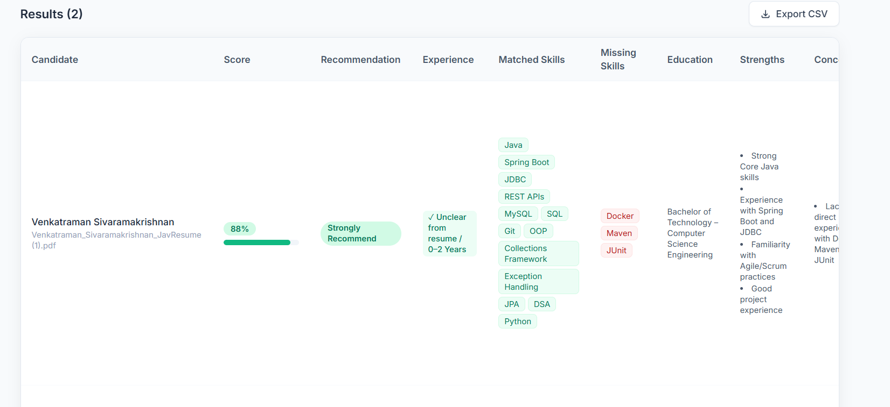

# ScreenIQ — AI Resume Screening Assistant


[](https://github.com/sivrkv/screeniq/actions)

ScreenIQ is an AI-powered resume screening assistant that helps recruiters evaluate candidates against job requirements in minutes instead of hours.

Upload resumes, add a job description, and get AI-generated candidate evaluations with:

- Match scores
- Hiring recommendations
- Experience analysis
- Matched and missing skills
- Strengths and concerns
- CSV shortlist export

**Live Demo:** https://screeniq-n8bq5m028-sivas-projects-ad73775a.vercel.app

**Repository:** https://github.com/sivrkv/screeniq

---

# Screenshots

## Resume Upload


## AI Screening Results



## CSV Export


---

# Features

## AI Resume Analysis

- Upload up to 5 PDF resumes
- Compare candidates against a job description
- Generate match scores from 0–100
- Extract relevant skills and experience
- Identify missing requirements

## Candidate Evaluation

Each candidate receives:

- Hiring recommendation:
  - Strongly Recommend
  - Recommend
  - Consider
  - Not Recommended

- Experience requirement comparison
- Education information
- Relevant experience summary
- Candidate strengths
- Potential concerns

## Export

- Export complete candidate evaluations as CSV
- Client-side CSV generation
- No additional server requests

---

# Tech Stack

| Category | Technology |
|---|---|
| Framework | Next.js 14 (App Router) |
| Language | TypeScript |
| Styling | Tailwind CSS |
| Validation | Zod |
| PDF Processing | pdf-parse |
| AI Model | Groq Llama 3.3 70B |
| AI Integration | OpenAI-compatible SDK |
| Deployment | Vercel |
| CI/CD | GitHub Actions |

---

# How It Works

```
User uploads resumes + job description
                |
                ↓
Server validates files and input
                |
                ↓
PDF text extraction
                |
                ↓
AI evaluation using Groq Llama 3.3
                |
                ↓
Structured candidate scoring
                |
                ↓
Ranked results + CSV export
```

The AI evaluates:

- Skills match
- Experience requirements
- Education
- Missing skills
- Candidate strengths
- Potential risks

---

# Architecture

```
app/
 ├── page.tsx
 │     Main UI and results display
 │
 └── api/analyze/
       Resume analysis API


components/
 └── ResultsTable.tsx
       Candidate results UI


lib/
 ├── groq.ts
 │     AI integration
 │
 ├── pdf.ts
 │     PDF extraction
 │
 ├── validation.ts
 │     Zod schemas
 │
 ├── json.ts
 │     Safe AI response parsing
 │
 ├── rateLimiter.ts
 │     API protection
 │
 └── types.ts
       Shared types
```

---

# Local Development

## Requirements

- Node.js 20+
- Groq API key

Create a free API key:

https://console.groq.com

Clone the repository:

```bash
git clone https://github.com/sivrkv/screeniq.git

cd screeniq

npm install
```

Create:

```
.env.local
```

Add:

```env
GROQ_API_KEY=your_api_key_here
```

Run:

```bash
npm run dev
```

Open:

```
http://localhost:3000
```

---

# Environment Variables

| Variable | Purpose |
|---|---|
| `GROQ_API_KEY` | Server-side Groq authentication |

The API key is:

- Stored only in environment variables
- Never exposed to users
- Never committed to GitHub

---

# Deployment

ScreenIQ uses GitHub Actions and Vercel.

Every push to `main` runs:

```
Git Push
    ↓
GitHub Actions
    ↓
Lint
Type Check
Build
    ↓
Vercel Deployment
```

Required secrets:

| Secret | Purpose |
|---|---|
| `VERCEL_TOKEN` | Vercel authentication |
| `VERCEL_ORG_ID` | Vercel project owner |
| `VERCEL_PROJECT_ID` | Deployment target |

---

# Engineering Highlights

- Server-side PDF validation
- Secure API key management
- Zod validation for AI responses
- Defensive LLM JSON parsing
- Rate limiting protection
- Type-safe Next.js architecture
- Automated CI/CD pipeline

---

# Known Limitations

- No database (results are not stored)
- No authentication system
- In-memory rate limiting
- Single AI provider (Groq)
- Experience extraction depends on resume formatting

Future improvements:

- Recruiter accounts
- Candidate history
- Multiple AI providers
- Background processing

---

# Why This Project

ScreenIQ was built to demonstrate practical AI engineering beyond simply calling an AI API.

The project focuses on:

- Reliable AI output handling
- Secure backend design
- Production deployment practices
- Modern TypeScript development
- Automated cloud delivery

---

# License

MIT